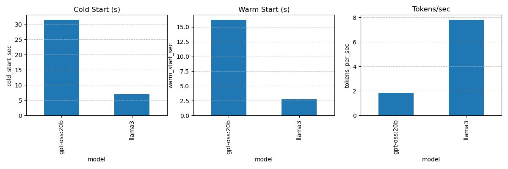

# 🧪 # AI Model Benchmark: Meta LLaMA 3 8B Instruct (Ollama build) vs OpenAI gpt-oss-20B


## 📋 System Information
- **OS:** Windows 11 Home / PowerShell 5.1  
- **GPU:** NVIDIA RTX 4050 Laptop GPU (6GB VRAM)  
- **Driver:** NVIDIA 580.xx  
- **Python:** 3.10 (Anaconda Base)  
- **Ollama Version:** Latest (as of Aug 2025)  
- **Benchmark Scripts:** Custom PowerShell + Python (`ollama_bench.ps1`, `repeat_bench.ps1`, `first_token_latency.py`, `generate_report.py`)

---

## 📊 Performance Summary

| Model            | Cold Start (s)      | Warm Start (s)  | First Token Latency (s) | TPS             | VRAM Before (MB) | VRAM After (MB) |
|------------------|---------------------|-----------------|-------------------------|-----------------|------------------|-----------------|
| **llama3**       | **6.95 ± 6.44**     | **2.77 ± 0.21** |       **10.06**         | **7.81 ± 0.74** | 3445.0 ± 2535.72 | 4906.33 ± 4.62  |
| **gpt-oss:20b**  | **31.47 ± 29.46**   | **16.23 ± 6.61**|       **38.69**         | **1.84 ± 0.05** | 4682.0 ± 271.86  | 4633.0 ± 232.05 |

---

## 🔍 Key Insights
- **🚀 Speed:** `llama3` is ~4× faster in token generation and ~5× faster in warm start.  
- **🕒 Latency:** First token appears in ~10s for `llama3` vs ~39s for `gpt-oss:20b`.  
- **📉 Variability:** `gpt-oss:20b` cold start fluctuates massively (18s–75s), while `llama3` stabilizes quickly after first load.  
- **💾 VRAM:** Both models stabilize around **~4.7–4.9 GB VRAM** after loading.

---

## 📈 Benchmark Plot


---

## 📦 How These Benchmarks Were Run

### Repeat Runs
We used `repeat_bench.ps1` to run **3 iterations** per model, measuring:
1. **VRAM before model load**
2. **Cold start time** (first run)
3. **Warm start time** (subsequent runs)
4. **Tokens per second (TPS)**
5. **VRAM after load**

### First Token Latency
Measured separately with:
```bash
python first_token_latency.py llama3
python first_token_latency.py gpt-oss:20b

### Report Generation

Aggregated results and plots generated using:

```bash
python generate_report.py
